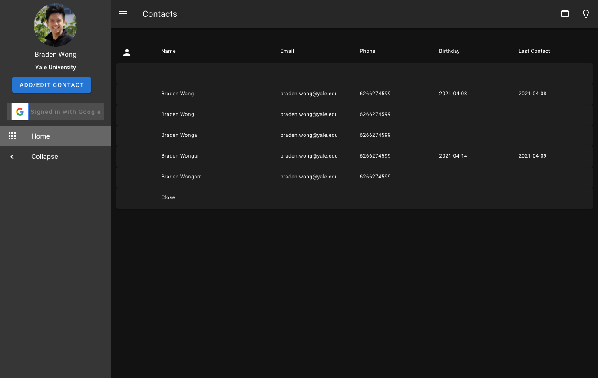
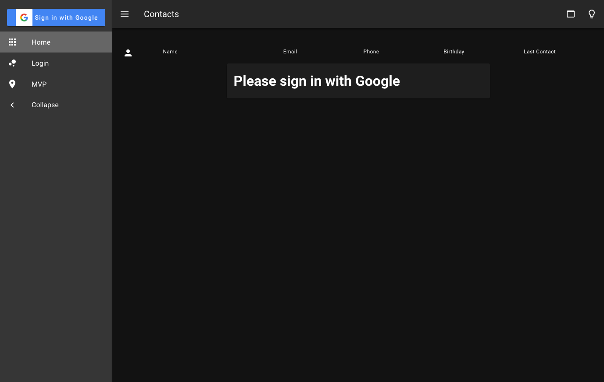

# Contacts-App

A simple CRUD app displaying a user's contacts.

- [Contacts-App](#contacts-app)
  - [Overview](#overview)
    - [Dashboard](#dashboard)
    - [Create Contact](#create-contact)
    - [View/Edit Contact](#viewedit-contact)
    - [Light Mode](#light-mode)
    - [Minified Mode](#minified-mode)
    - [Login](#login)
  - [Data Storage](#data-storage)
    - [FireStore](#firestore)
    - [Contacts](#contacts)
  - [Data Editing](#data-editing)
  - [Other technologies](#other-technologies)
    - [Vuex](#vuex)
    - [Vuexfire](#vuexfire)
    - [mapFields](#mapfields)
  - [Setup](#setup)
    - [To Develop](#to-develop)
    - [To Serve Static Site](#to-serve-static-site)
  - [Todos](#todos)

## Overview

### Dashboard

The default dashboard for the app looks like the following:


### Create Contact

To create a contact, click the create contact button:


### View/Edit Contact

To view or edit a contact, click the row corresponding to that contact:


### Light Mode

You can toggle light mode using the lightbulb button on the top right:


### Minified Mode

You can toggle minified mode using the bar button on the top right:


### Login

If not logged in, the user is prompted to do so:


## Design

### Vuex

Vuex is the source of truth for this project, with the following namespaced modules:

1. Index: This stores general states that the user is in

   - Dialog: It toggles whether to overlay the contact modal or not
   - Editing mode: It toggles whether the contact modal's UI should display text for editing or creating a new contact
   - Contacts: The contacts of the users, stored as an array of contact objects
   - VuexFire bindings: VuexFire mutations create a one-way binding from a user's contacts on Firestore with the contacts in the Vuex store. More elaborated [in the Vuexfire section](###Vuexfire)

2. Auth: This stores user a user's login status and credentials pulled from Firebase Auth

3. Buffer: This stores information of the currently edited contact, which is displayed when the modal is opened. It is autopopulated when a contact is clicked, and cleared when the "Add Contact" is clicked.

### Vuexfire

Vuexfire is used to set a real-time one way binding from a user's contacts on Firestore to their contacts in Vuex. Therefore, Firestore is the source of truth over Vuex for **user contacts.**

When adding and editing contacts, the changes are written to Firestore directly, which are then automatically pulled and updated in the Vuex store, which subsequently updates the application.

Note that Vuex is the source of truth for most other values, such as the buffer

## Other technologies

### mapFields

You may encounter the mapFields plugin, which is used to simplify a two-way data-binding with a form. This is used to synchronize the modal values with the values stored in the **buffer** module of the Vuex store

## TODO

- [ ] Logout button/Proper Logout handling
  - Currently, logging in with other accounts temporarily displays residual information from the last account, because there is no proper logout handling
  - [ ] Create a button tha triggers the logout function in Firebase auth. You can respond to the logout detected state in auth.js. **Make sure to clear the Vuex store**.
- [ ] Persistent login
  - The login state of Vuex does not last after a refresh or close/open.
  - [ ] Make the Vuex persist, perhaps through writing to cookies or storing a JWT token
- [ ] Profile Upload (with Firebase storage)
  - [ ] Hook up Firebase storage so profile pictures are uploaded, then store the url with the rest of the buffer.
- [ ] Duplicate names
  - Currently, contact names are used as the document names in Firestore. 
  - [ ] Creating a unique id per each contact would help avoid overwriting contacts when there is name collision.
- [ ] Change data types
  - Dates and phone numbers are currently stored as strings; changing these to the appropriate types could be useful.

## Setup

Clone this repo to your local machine

### To Develop

```bash
# install dependencies
$ npm install

# serve with hot reload at localhost:3000
$ npm run dev
```

### To Serve Static Site

```bash

# generate static project, for hosting on CDN/serverless platforms like Netlify
$ npm run generate

# serve using statically generated project
$ npm run start
```
